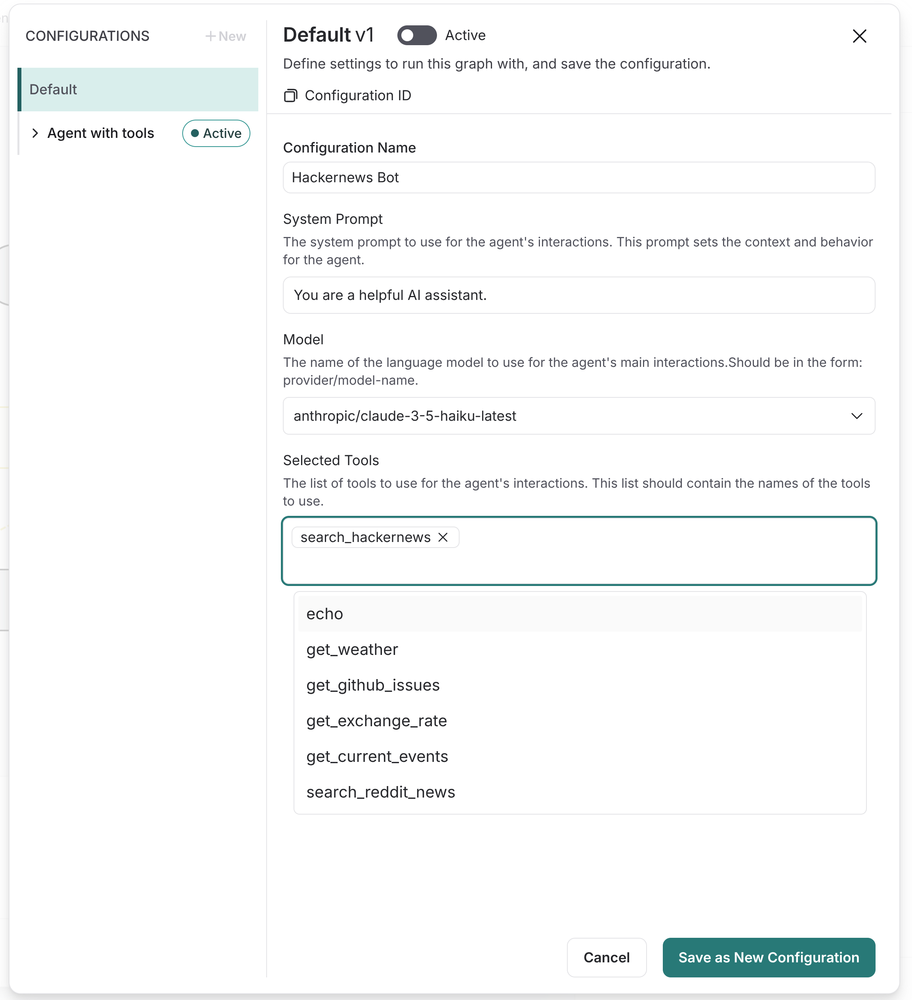

# LangGraph ReAct Agent Template

A LangGraph Platform agent template that can be used to deploy a ReAct agent with access to a [universal-tool-server](https://github.com/langchain-ai/open-tool-server/).

## LangGraph Studio UI

Use the LangGraph Studio UI to create and manage agents via simple configuration.



## Getting started

To use this template, follow these steps:

1. [Deploy a universal-tool-server](#deploy-a-universal-tool-server): You can use the example tool server or create your own.
2. [Launch the ReAct agent locally](#launch-the-react-agent): Use the tool server URL and API key to launch the ReAct agent locally.
3. Deploy on LangGraph Cloud: Follow the tutorial here: https://langchain-ai.github.io/langgraph/cloud/quick_start/, but fork this repository instead of the regular react agent template.

### Deploy a Universal Tool Server

#### Using the Example Tool Server

1. Get the code

    ```shell
    git clone git@github.com:langchain-ai/example-tool-server.git 
    ```

2. Run the tool server

    ```shell
    cd example-tool-server
    # Only disable auth if you are running the tool server locally.
    # This is done for simplicity during development.
    DISABLE_AUTH=true uv run uvicorn app.server:app  
    ```
   
See the [example-tool-server](https://github.com/langchain-ai/example-tool-server) for more information on how to deploy and configure the tool server.


#### From Scratch

1. Install the universal-tool-server package.

    ```shell
    pip install universal-tool-server
    ```

2. Create a new Python file called **server.py** and implement a simple tool server:

    ```python
    from universal_tool_server import Server

    app = Server()

    # Define tools
    @app.add_tool(permissions=["group1"])
    async def echo(msg: str) -> str:
        """Echo a message."""
        return msg + "!"
    ```

3. Run the tool server.

    ```shell
    uv run uvicorn server:app
    ```

### Launch the ReAct Agent

If you already have a tool server running, you can launch the ReAct agent with the following command:

```shell
# Specify at least one chat model API key!
export ANTHROPIC_API_KEY="..."
export OPENAI_API_KEY="..."
# If you enabled auth on the tool server, set the API key.
# If you disabled auth, you set it to a non empty placeholder string.
export TOOL_SERVER_API_KEY="Authorization header token"
# Set the tool server URL
export TOOL_SERVER_URL="http://localhost:8000"
# Launch the ReAct agent
uv run langgraph dev
````

